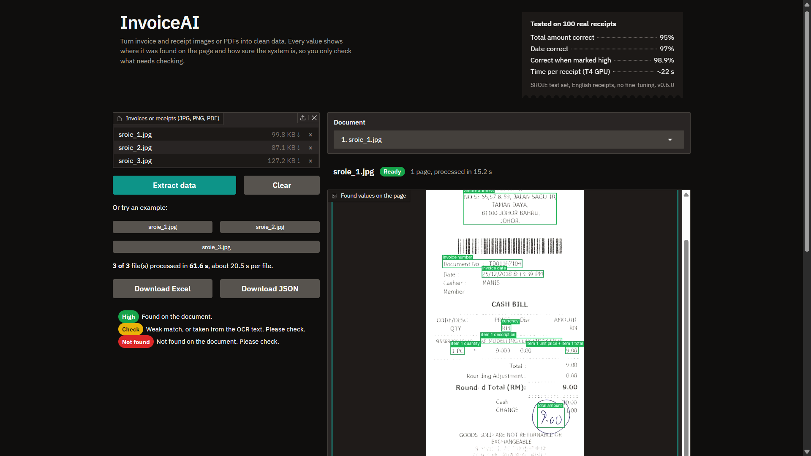
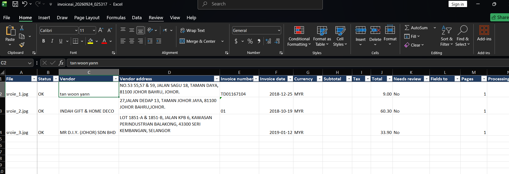
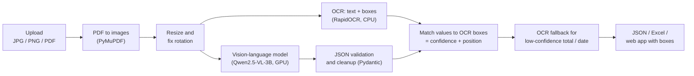

# InvoiceAI

**Turn invoice and receipt images or PDFs into clean, structured data (JSON and Excel), with a confidence level for every value.**

[](https://github.com/SamiHotak/invoice-ai/actions/workflows/ci.yml)


[](https://colab.research.google.com/github/SamiHotak/invoice-ai/blob/main/notebooks/03_demo.ipynb)

<!-- Replace with a real screenshot or GIF: upload it to docs/images/ with this name. -->


On 100 real receipts it reads the **total amount correctly 95% of the time**. More important for a business: when it says it is sure, it is right **98.9% of the time**, and it marks the rest for a person to check.

---

## The problem

Typing invoices and receipts into a spreadsheet or accounting system is slow, boring and full of small mistakes: a wrong digit in a total, a date in the wrong format, a missed receipt. Classic OCR tools read the text, but they do not know which number is the total, and they never tell you when they are unsure.

## The solution

InvoiceAI combines two kinds of AI:

1. A **vision-language model** (Qwen2.5-VL) that looks at the document like a person and returns the fields as JSON: vendor, address, invoice number, date, currency, line items, subtotal, tax and total.
2. An **OCR engine** (PP-OCR) that finds every piece of text on the page and where it is.

Every value from the model is then checked against the OCR text. If the value is printed on the page, it gets **high** confidence and a box on the image. If not, it is flagged for review, and for the total and date a rule-based **OCR fallback** tries to read the value directly from the page.

The result: most documents need no human work, and the few that do are clearly marked.

## Features

- **Input:** JPG, PNG and PDF (multi-page), one file or many at once
- **Output:** JSON, and a formatted Excel file (sheets: Invoices, Line Items, Legend)
- **Confidence for every field:** high / medium / low, shown in green / yellow / red
- **Shows where each value was found** with colored boxes on the page
- **OCR fallback** for the total and the date, clearly marked as such
- **Excel for reviewers:** uncertain cells are colored, plus "Needs review" and "Fields to check" columns; failed files stay in the file as "Error" rows, so nothing gets lost
- **Web app** (Gradio) with drag-and-drop, example files, and downloads
- **REST API** (FastAPI) with interactive docs at `/docs`
- **Safe input checks:** file type, size, empty files, renamed files (e.g. a `.txt` renamed to `.pdf`)
- **Docker** image and `docker compose` setup for GPU servers
- **71 automated tests** (no GPU needed) and CI on every push

## Screenshots

<!-- Upload your screenshots to docs/images/ with these names. -->

| Web app | Excel export |
|---|---|
|  |  |

## How it works



The cleanup step turns typical model output into consistent data: dates in ISO format (`2018-03-05`), amounts as numbers (`1,234.50` and `1.234,50` both become `1234.5`), currency symbols as ISO codes (`RM` becomes `MYR`).

## Results

Tested on **100 receipts** from the SROIE test set (real scanned receipts), with no fine-tuning. The prompt and the fallback were chosen on the separate train set, so the test numbers are not tuned to the test data.

| Field | Exact match | Fuzzy match (≥ 90) |
|---|---|---|
| Total amount | **95%** | 95% |
| Date | **97%** | 100% |
| Vendor name | **90%** | 94% |
| Vendor address | 79% | **97%** |

"Exact match" ignores case, spaces and punctuation. Most address "errors" are small OCR-style differences (the fuzzy match is 97%). Full report: [`eval/results.md`](eval/results.md).

### From 82% to 95%

| | Prompt | OCR fallback | Total amount correct |
|---|---|---|---|
| Round 1 | v2 | no | 82% |
| Round 2 | v3 (based on error analysis) | yes | **95%** |

In round 1, the model sometimes *calculated* a total instead of copying it, or invented the year of a date. Two changes fixed most of this: clearer prompt rules ("copy the number exactly as printed, never calculate"), and the OCR fallback for totals the model could not find on the page. Round 1 report: [`eval/results_round1.md`](eval/results_round1.md).

### The confidence level is the real value

For the total amount:

| Confidence | Receipts | Correct |
|---|---|---|
| High | 90 of 100 | **98.9%** |
| Medium (flagged for review) | 10 of 100 | 60% |

So **90% of receipts can be processed automatically** with almost no errors, and the other **10% are flagged** for a quick human check. That is the difference between a demo and a tool a bookkeeper can trust.

Speed: about **20 seconds per receipt** on a free Google Colab T4 GPU (OCR ~3.5 s, model ~15 s).

## Quick start

### Option 1: Google Colab (easiest, free GPU)

| Notebook | What it does |
|---|---|
| [`03_demo.ipynb`](https://colab.research.google.com/github/SamiHotak/invoice-ai/blob/main/notebooks/03_demo.ipynb) | Web app with a public link |
| [`04_api.ipynb`](https://colab.research.google.com/github/SamiHotak/invoice-ai/blob/main/notebooks/04_api.ipynb) | REST API with the `/docs` page |
| [`01_quickstart.ipynb`](https://colab.research.google.com/github/SamiHotak/invoice-ai/blob/main/notebooks/01_quickstart.ipynb) | Extraction in a few lines of Python |
| [`02_evaluation.ipynb`](https://colab.research.google.com/github/SamiHotak/invoice-ai/blob/main/notebooks/02_evaluation.ipynb) | Reproduce the results above |

Choose `Runtime → Change runtime type → T4 GPU`, then run the cells in order.

### Option 2: Local (needs an NVIDIA GPU with about 10 GB of memory)

```bash
git clone https://github.com/SamiHotak/invoice-ai.git
cd invoice-ai
pip install -r requirements.txt

python -m ui.gradio_app                              # web app: http://localhost:7860
uvicorn api.main:app --host 0.0.0.0 --port 8000      # API:     http://localhost:8000/docs
```

The model (~7 GB) is downloaded on the first start. For tests and evaluation, install `requirements-dev.txt` instead.

### Option 3: Docker

Needs an NVIDIA GPU, the NVIDIA driver and the [NVIDIA Container Toolkit](https://docs.nvidia.com/datacenter/cloud-native/container-toolkit/latest/install-guide.html).

```bash
docker compose up -d api                  # API on http://localhost:8000/docs
docker compose --profile ui up -d ui      # or: web app on http://localhost:7860
```

Run only one of the two on a 16 GB GPU. The model is downloaded once into a Docker volume. The default PyTorch build uses CUDA 13 (NVIDIA driver 580 or newer); for an older driver, see the comment at the top of the [`Dockerfile`](Dockerfile).

## API

| Method | Endpoint | Description |
|---|---|---|
| GET | `/health` | Service status (is the model loaded?) |
| POST | `/extract` | One file → JSON result |
| POST | `/extract/batch` | Many files → list of results (one bad file does not stop the others) |
| POST | `/export/excel` | Many files → Excel download |

```bash
# One file
curl -F "file=@samples/sroie_1.jpg" http://localhost:8000/extract

# Many files
curl -F "files=@samples/sroie_1.jpg" -F "files=@invoice.pdf" http://localhost:8000/extract/batch

# Excel download
curl -F "files=@samples/sroie_1.jpg" -F "files=@samples/sroie_2.jpg" \
     http://localhost:8000/export/excel -o invoices.xlsx
```

Example response (shortened, values are illustrative):

```json
{
  "status": "ok",
  "file_name": "receipt.jpg",
  "invoice": {
    "vendor_name": "BOOK TA .K (TAMAN DAYA) SDN BHD",
    "invoice_number": "TD01167104",
    "invoice_date": "2018-12-25",
    "currency": "MYR",
    "line_items": [{"description": "KF MODELLING CLAY KIDDY FISH", "quantity": 1.0, "unit_price": 9.0, "total": 9.0}],
    "total_amount": 9.0
  },
  "fields": {
    "total_amount": {
      "value": 9.0,
      "confidence": "high",
      "source": "model",
      "box": {"x0": 612.0, "y0": 1204.0, "x1": 688.0, "y1": 1231.0, "page": 0}
    }
  },
  "warnings": [],
  "processing_seconds": 18.8
}
```

Errors come back with a clear code and message, for example `{"error": "file_type_mismatch", "message": "'fake.pdf' does not look like a real .pdf file."}`.

## Configuration

All settings can be changed with environment variables (see [`app/config.py`](app/config.py)). The most useful:

| Variable | Default | Meaning |
|---|---|---|
| `INVOICEAI_MODEL` | `Qwen/Qwen2.5-VL-3B-Instruct` | Hugging Face model |
| `INVOICEAI_DTYPE` | `float16` | `bfloat16` on newer GPUs |
| `INVOICEAI_MAX_PIXELS` | `1003520` | Image size for the model (smaller = faster) |
| `INVOICEAI_OCR_FALLBACK` | `true` | Use the OCR fallback for total and date |
| `INVOICEAI_MAX_UPLOAD_MB` | `20` | Largest accepted file |
| `INVOICEAI_ALLOW_CPU` | `false` | Allow running without a GPU (very slow) |

## Project structure

```
app/        core: extraction, OCR, matching, fallback, export, schema, settings
api/        FastAPI REST API
ui/         Gradio web app
eval/       evaluation on SROIE and the result reports
notebooks/  Google Colab notebooks
tests/      automated tests (a fake pipeline, so no GPU is needed)
```

Run the tests with `pip install -r requirements-dev.txt` and `python -m pytest`.

## Limitations

To be clear about what this project is and is not:

- **Tested on receipts only.** SROIE contains Malaysian receipts in English and labels 4 fields (vendor, address, date, total). Line items, invoice numbers, tax and multi-page invoices work, but their accuracy is **not measured**. Other layouts and languages may do worse.
- **No fine-tuning.** The results come from prompting a general model. Fine-tuning on the client's own documents would likely improve accuracy.
- **"High" confidence means "found on the page", not "correct".** For example, a person's name printed above the shop name can be taken as the vendor and still get high confidence.
- **Speed:** about 20 s per document on a T4 GPU, one document at a time. A production system would add a job queue and a faster GPU.
- **Not production-hardened:** the API has no login or rate limit, and money values are stored as floats (a real accounting system would use decimals).
- **Model license:** Qwen2.5-VL-3B-Instruct is released under the [Qwen Research License](https://huggingface.co/Qwen/Qwen2.5-VL-3B-Instruct/blob/main/LICENSE), which restricts commercial use. For commercial use, switch to a model with a commercial license (for example Qwen2.5-VL-7B-Instruct, Apache 2.0, which needs a larger GPU) with `INVOICEAI_MODEL`, and re-run the evaluation.
- The Docker image is built and checked in CI, but CI has no GPU, so the model itself is only tested on Google Colab.

## Roadmap

- **v2:** LoRA fine-tuning on receipts and invoices; measure line items and tax
- More document types (European invoices, multi-page invoices) and languages
- Run OCR and the model at the same time (about 3.5 s faster per document)
- Smaller or quantized model for a CPU-only version
- Job queue for many documents at once

## Credits

- **Dataset:** SROIE (ICDAR 2019 Robust Reading Challenge on Scanned Receipts OCR and Information Extraction), Hugging Face copy [`jsdnrs/ICDAR2019-SROIE`](https://huggingface.co/datasets/jsdnrs/ICDAR2019-SROIE), license CC BY 4.0. The sample receipts in `samples/` come from this dataset.
- **Model:** [Qwen2.5-VL-3B-Instruct](https://huggingface.co/Qwen/Qwen2.5-VL-3B-Instruct) by the Qwen team
- **OCR:** PP-OCR models (PaddleOCR) via [RapidOCR](https://github.com/RapidAI/RapidOCR)

## License

The code is released under the [MIT License](LICENSE). The model and the dataset have their own licenses (see above).

## Author

Built by **Ezat** ([@SamiHotak](https://github.com/SamiHotak)), ML / computer vision engineer. Available for document AI and data extraction projects.
